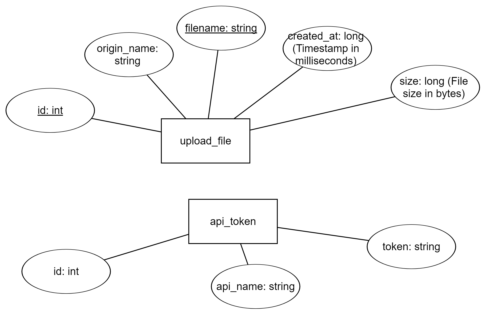

### File Server

### Requirement Specifications
- multiple 
- simultaneous
- stable 
- resumable

### Architecture

### Manage, build and run
- Package structure
  - src
    - main
      - java
        - uni.akilis.file_server
          - config: Configuration initialization before application starts up.
          - controller: Controller layer in MVC.
          - dao: Capsuling the data read/write layer with Data Access Object pattern.
          - dto: Exchange data with front-end and web server with Data transfer Object pattern.
          - entity: Entities for ORM pattern.
          - filter: Filtering specific requests with some strategies.
          - repository: Actual data manipulation layer in Spring JPA.
          - service: Implementation for the core business logic.
          - util: Some utilities.
          - Application.java: This application should start from here.
      - resources: Please follow the convention of development in Spring Boot Web MVC. 
        - config: External configuration files loaded by Spring Boot when app is starting up.
        - static
          - css
          - fronts
          - img
          - js
          - myJs
            - demo.js: Demonstrate how to use this file server at front-end in Javascript.
          - demo.html: Demonstrate how to use this file server at front-end in HTML.
    - test/java/uni.akilis.file_server: Unit testing.
    - pom.xml: This project is managed by Maven.
- Build: `mvn clean package -DskipTests`
- Run: `java -jar <file.jar>`

### Deployment

- Configure the API token for authentication
    - Modify application.properties annotated with `## token` 
- Configure the database
    - Modify application.properties annotated with `## mysql` and `## msserver sql`
- Configure Web Server interfaces
    - Modify application.yml annotated with `#UploadWatcher parameters`
- Configure logging
    - Modify application.properties annotated with `## logging`
- Configure file server's port
    - Modify application.properties annotated with `## token`. 
    - **Note that** if Web Server interfaces are mocked then port in application.yml should be consistent with the one in application.properties.
    

### Example of coordination with another web server.

### ER diagram

