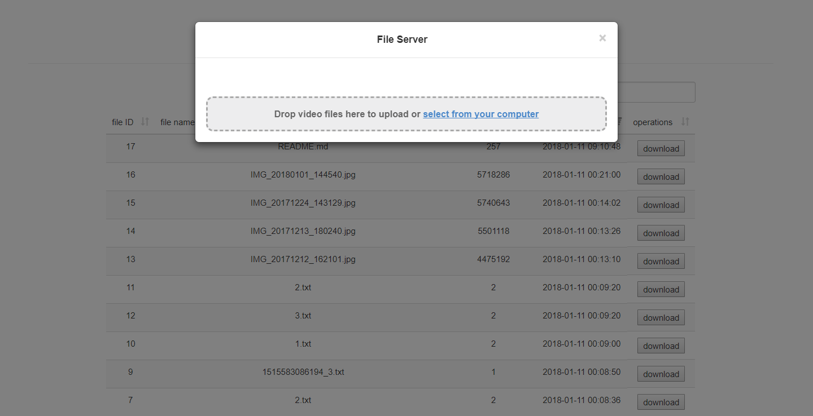

### File Server

### Requirement Specifications
- multiple 
- simultaneous
- stable 
- resumable

### Architecture

### Manage and build
- maven
    - build a jar: `mvn clean package -DskipTests`

### Deployment

- Configure the API token for authentication
    - Modify application.properties annotated with `## token` 
- Configure the database
    - Modify application.properties annotated with `## msserver sql`
- Configure Web Server interfaces
    - Modify application.yml annotated with `#UploadWatcher parameters`
- Configure logging level
    - Modify application.properties annotated with `## logging`

### Example of coordination with another web server.

### ER diagram

